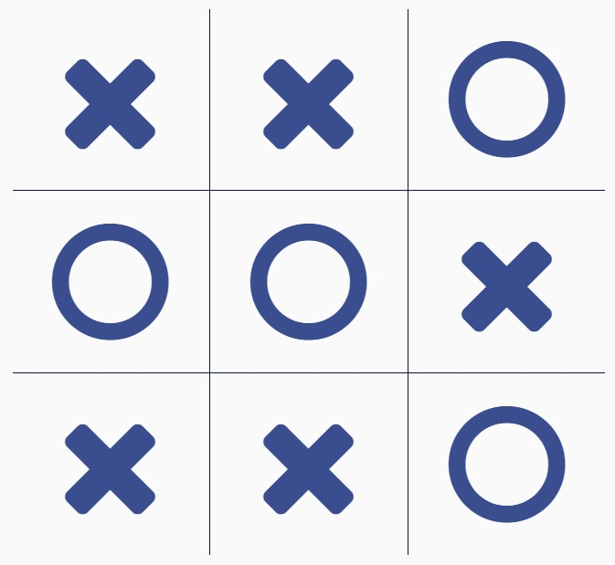

# Tic-Tac-Toe Game

A simple Tic-Tac-Toe game implemented using HTML, CSS, and JavaScript. This project provides a clean and interactive interface to play the classic game of Tic-Tac-Toe.

---

## Features

- Interactive 3x3 grid for two players: **X** and **O**.
- Dynamic game status updates, including the current player's turn.
- Automatically detects and announces the winner or a draw.
- Restart button to reset the game and play again.
- Clean and responsive design.

---

## Demo



---

## How to Play

1. Clone the repository:
   ```bash
   git clone https://github.com/yourusername/tic-tac-toe.git
   cd tic-tac-toe
2. Open index.html in your browser to start the game.

3. Click on any cell to place your mark (X or O) during your turn.

4. The game will announce a winner or declare a draw based on the result.

5. Click the Restart Game button to reset and play again.
